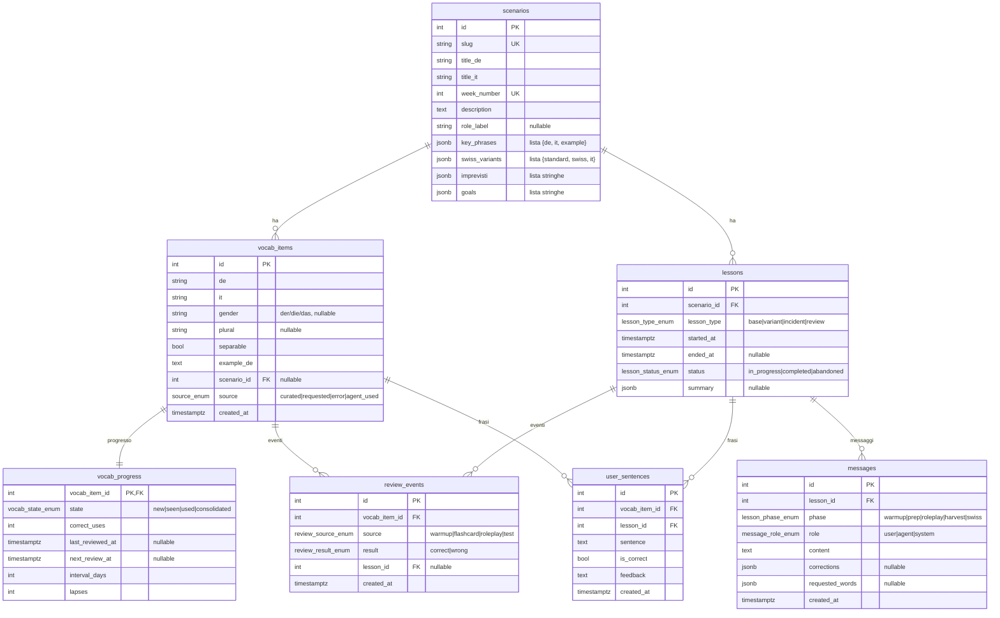

# Schema DB — Deutsch-Tutor

Migrazione Alembic `0001_initial` (task 1.2). Tutte le enum sono tipi nativi Postgres.

## ERD

## Tabelle

| Tabella | Scopo |
|---|---|
| `scenarios` | I 12 scenari del piano di studi; contenuti completi (key_phrases, varianti svizzere, imprevisti, goals) via JSONB. |
| `vocab_items` | Parole/frasi target, con genere, plurale, separabile, esempio e origine (`source`). |
| `vocab_progress` | Stato SRS per vocabolo (1:1 con `vocab_items`): stato, usi corretti, intervallo, lapses. |
| `review_events` | Storico degli eventi di ripasso (warmup, flashcard, roleplay, test) per le statistiche e la consolidazione. |
| `lessons` | Lezioni del piano (base, variant, incident, review) con stato e summary. |
| `messages` | Messaggi della lezione per fase, con correzioni e parole richieste (JSONB). |
| `user_sentences` | Frasi dell'utente per vocabolo, con esito e feedback. |

## Enum native

| Nome tipo | Valori |
|---|---|
| `source_enum` | curated, requested, error, agent_used |
| `vocab_state_enum` | new, seen, used, consolidated |
| `review_source_enum` | warmup, flashcard, roleplay, test |
| `review_result_enum` | correct, wrong |
| `lesson_type_enum` | base, variant, incident, review |
| `lesson_status_enum` | in_progress, completed, abandoned |
| `lesson_phase_enum` | warmup, prep, roleplay, harvest, swiss |
| `message_role_enum` | user, agent, system |

## Note

- `llm_calls` (log chiamate LLM) arriva in Fase 3, non fa parte dello schema minimo del task 1.2.
- `swiss_variants` è una lista di `{standard, swiss, it}` (v1.1); la bozza v1 la lasciava non tipizzata.
